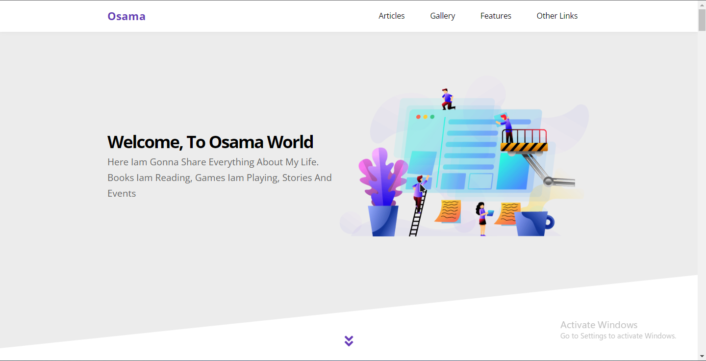

# Welcome to HTML, CSS and JS template project:

## Project Overview:

#### This is a responsive website template developed by using HTML, CSS and JS. It is designed to be modern, clean and visually appealing. The template features a minimalistic design and is optimized for performance.

## Features:

- Responsive design: The template is designed to be responsive, meaning it adjusts to the size of the device it is being viewed on. The layout of the template is fluid and adjusts to fit the screen size of the device it is being viewed on, whether that be a laptop, tablet or mobile phone.

- Clean and minimalistic design: The template features a clean and minimalistic design, with a focus on simplicity and clarity. The design emphasizes white space and negative space, making it easy for users to quickly scan the content.

- HTML, CSS and JS: The template uses a combination of HTML, CSS and JS to create the structure and style of the website. CSS is used to define the styles and layout of the website, while JS is used to add interactivity and functionality to the site.

- Optimization for performance: The template is optimized for performance, meaning it loads quickly and smoothly, even on slower internet connections. The template loads quickly thanks to the use of optimized images, the use of a CSS preprocessor and the use of compressed CSS and JS files.

- Mobile-first approach: The template follows a mobile-first approach, meaning that the mobile version of the website is designed first and the desktop version is designed after. This approach ensures that the website is optimized for mobile devices and that it looks and functions well across all devices.

- Integration with other technologies: The template can be easily integrated with other technologies, such as a content management system (CMS) or a blogging platform. This means that the website can be easily updated and maintained, even by users who do not have strong technical skills.

## Technical Requirements:

#### Front-End

- HTML, CSS and JS:
  To use this template, it requires a basic understanding of HTML, CSS and JS. The template comes with a CSS framework and a JS library, which can save time and effort when it comes to developing the website.

## In conclusion

- the HTML, CSS and JS template is a modern, clean and visually appealing template that is optimized for performance and is easy to customize and use. It requires a basic understanding of HTML, CSS and JS, and can be used with serve rside scripting and web hosting. The template comes with a detailed documentation, making it easy to install, customize and use.

## preview project image :

## Live Demo : https://osamayouseff.github.io/third-template/
